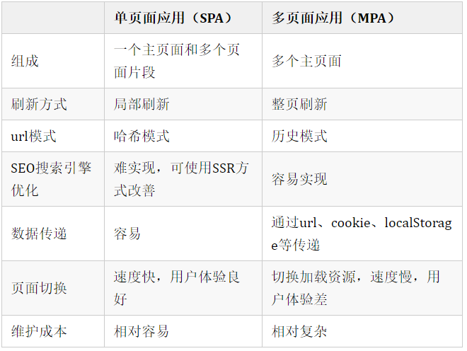

## (一)什么是SPA
SPA（single-page application），翻译过来就是单页应用  

SPA是一种网络应用程序或网站的模型，它通过动态重写当前页面来与用户交互，这种方法避免了页面之间切换打断用户体验  

在单页应用中，所有必要的代码（HTML、JavaScript和CSS）都通过单个页面的加载而检索，或者根据需要（通常是为响应用户操作）动态装载适当的资源并添加到页面  

页面在任何时间点都不会重新加载，也不会将控制转移到其他页面

举个例子来讲就是一个杯子，早上装的牛奶，中午装的是开水，晚上装的是茶，我们发现，变的始终是杯子里的内容，而杯子始终是那个杯子
## (二)SPA和MPA的区别
MPA（MultiPage-page application），翻译过来就是多页应用  

在MPA中，每个页面都是一个主页面，都是独立的  

当我们在访问另一个页面的时候，都需要重新加载html、css、js文件，公共文件则根据需求按需加载
### 单页应用与多页应用的区别

### 单页应用优缺点
#### 优点：
1.具有桌面应用的即时性、网站的可移植性和可访问性  
2.用户体验好、快，内容的改变不需要重新加载整个页面  
3.良好的前后端分离，分工更明确  
#### 缺点：
1.不利于搜索引擎的抓取  
2.首次渲染速度相对较慢  
## (三)实现一个SPA
### 原理
1.监听地址栏中hash变化驱动界面变化  
2.用pushsate记录浏览器的历史，驱动界面发送变化

### 实现
#### hash 模式
核心通过监听url中的hash来进行路由跳转
```
<script>
    // 定义 Router
    class Router {
        constructor () {
            this.routes = {}; // 存放路由path及callback
            this.currentUrl = '';
            
            // 监听路由change调用相对应的路由回调
            window.addEventListener('load', this.refresh, false);
            window.addEventListener('hashchange', this.refresh, false);
        }
        
        route(path, callback){
            this.routes[path] = callback;
        }
        
        push(path) {
            this.routes[path] && this.routes[path]()
        }
    }

    // 使用 router
    window.miniRouter = new Router();
    miniRouter.route('/', () => console.log('page1'))
    miniRouter.route('/page2', () => console.log('page2'))

    miniRouter.push('/') // page1
    miniRouter.push('/page2') // page2
    </script>
```
#### history模式
history 模式核心借用 HTML5 history api，api 提供了丰富的 router 相关属性  
#### 先了解一个几个相关的api
1.history.pushState 浏览器历史纪录添加记录  
2.history.replaceState修改浏览器历史纪录中当前纪录  
3.history.popState 当 history 发生变化时触发  
```
<script>
    // 定义 Router
    class Router {
        constructor () {
            this.routes = {};
            this.listerPopState()
        }
        
        init(path) {
            history.replaceState({path: path}, null, path);
            this.routes[path] && this.routes[path]();
        }
        
        route(path, callback){
            this.routes[path] = callback;
        }
        
        push(path) {
            history.pushState({path: path}, null, path);
            this.routes[path] && this.routes[path]();
        }
        
        listerPopState () {
            window.addEventListener('popstate' , e => {
                const path = e.state && e.state.path;
                this.routers[path] && this.routers[path]()
            })
        }
    }

    // 使用 Router

    window.miniRouter = new Router();
    miniRouter.route('/', ()=> console.log('page1'))
    miniRouter.route('/page2', ()=> console.log('page2'))

    // 跳转
    miniRouter.push('/page2')  // page2
</script>
```
## (四)如何给SPA做SEO（搜索引擎优化）
### 1.SSR服务端渲染
将组件或页面通过服务器生成html，再返回给浏览器，如nuxt.js
### 2.静态化
目前主流的静态化主要有两种：  
（1）一种是通过程序将动态页面抓取并保存为静态页面，这样的页面的实际存在于服务器的硬盘中  
（2）另外一种是通过WEB服务器的 URL Rewrite的方式，它的原理是通过web服务器内部模块按一定规则将外部的URL请求转化为内部的文件地址，一句话来说就是把外部请求的静态地址转化为实际的动态页面地址，而静态页面实际是不存在的。这两种方法都达到了实现URL静态化的效果
### 3.使用Phantomjs针对爬虫处理
原理是通过Nginx配置，判断访问来源是否为爬虫，如果是则搜索引擎的爬虫请求会转发到一个node server，再通过PhantomJS来解析完整的HTML，返回给爬虫。  
下面是大致流程图  

