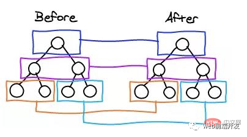

## vue的diff算法理解
1）diff算法的作用：用来修改dom的一小段，不会引起dom树的重绘

2）diff算法的实现原理：diff算法将virtual dom的某个节点数据改变后生成的新的vnode与旧节点进行比较，并替换为新的节点，具体过程就是调用patch方法，比较新旧节点，一边比较一边给真实的dom打补丁进行替换

3）具体过程详解：

a、在采用diff算法进行新旧节点进行比较的时候，比较是按照在同级进行比较的，不会进行跨级比较：

b、当数据发生改变的时候，set方法会调用dep.notify通知所有的订阅者watcher，订阅者会调用patch函数给响应的dom进行打补丁，从而更新真实的视图

c、patch函数接受两个参数，第一个是旧节点，第二个是新节点，首先判断两个节点是否值得比较，值得比较则执行patchVnode函数，不值得比较则直接将旧节点替换为新节点。如果两个节点一样就直接检查对应的子节点，如果子节点不一样就说明整个子节点全部改变不再往下对比直接进行新旧节点的整体替换

d、patchVnode函数：找到真实的dom元素；判断新旧节点是否指向同一个对象，如果是就直接返回；如果新旧节点都有文本节点，那么直接将新的文本节点赋值给dom元素并且更新旧的节点为新的节点；如果旧节点有子节点而新节点没有，则直接删除dom元素中的子节点；如果旧节点没有子节点，新节点有子节点，那么直接将新节点中的子节点更新到dom中；如果两者都有子节点，那么继续调用函数updateChildren

e、updateChildren函数：抽离出新旧节点的所有子节点，并且设置新旧节点的开始指针和结束指针，然后进行两辆比较，从而更新dom（调整顺序或者插入新的内容 结束后删掉多余的内容）