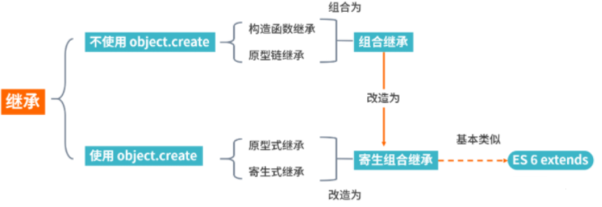

## 一、继承
如果一个类别B“继承自”另一个类别A，就把这个B称为“A的子类”，而把A称为“B的父类别”也可以称“A是B的超类”
### 继承的优点
1.继承可以使得子类具有父类别的各种属性和方法，而不需要再次编写相同的代码   
2.在子类别继承父类别的同时，可以重新定义某些属性，并重写某些方法，即覆盖父类别的原有属性和方法，使其获得与父类别不同的功能   
## 二、实现方式
下面给出JavaScripy常见的继承方式：
1.原型链继承

2.构造函数继承（借助 call）

3.组合继承

4.原型式继承

5.寄生式继承

6.寄生组合式继承

7.es6新增的extends关键字
### 原型链继承
原型链继承是比较常见的继承方式之一，其中涉及的构造函数、原型和实例，三者之间存在着一定的关系，即每一个构造函数都有一个原型对象，原型对象又包含一个指向构造函数的指针，而实例则包含一个原型对象的指针
```
    function Parent() {
    this.name = 'parent1';
    this.play = [1, 2, 3]
    }
    function Child() {
    this.type = 'child2';
    }
    Child.prototype = new Parent();
    console.log(new Child())
```
上面代码看似没问题，实际存在潜在问题
```
    var s1 = new Child();
    var s2 = new Child();
    s1.play.push(4);
    console.log(s1.play, s2.play); // [1,2,3,4]
```
改变s1的play属性，会发现s2也跟着发生变化了，这是因为两个实例使用的是同一个原型对象，内存空间是共享的
### 构造函数继承
借助 call调用Parent函数
```
    function Parent(){
        this.name = 'parent1';
    }

    Parent.prototype.getName = function () {
        return this.name;
    }

    function Child(){
        Parent1.call(this);
        this.type = 'child'
    }

    let child = new Child();
    console.log(child);  // 没问题
    console.log(child.getName());  // 会报错
```
可以看到，父类原型对象中一旦存在父类之前自己定义的方法，那么子类将无法继承这些方法

相比第一种原型链继承方式，父类的引用属性不会被共享，优化了第一种继承方式的弊端，但是只能继承父类的实例属性和方法，不能继承原型属性或者方法
### 组合继承
前面我们讲到两种继承方式，各有优缺点。组合继承则将前两种方式继承起来
```
    function Parent3 () {
        this.name = 'parent3';
        this.play = [1, 2, 3];
    }

    Parent3.prototype.getName = function () {
        return this.name;
    }
    function Child3() {
        // 第二次调用 Parent3()
        Parent3.call(this);
        this.type = 'child3';
    }

    // 第一次调用 Parent3()
    Child3.prototype = new Parent3();
    // 手动挂上构造器，指向自己的构造函数
    Child3.prototype.constructor = Child3;
    var s3 = new Child3();
    var s4 = new Child3();
    s3.play.push(4);
    console.log(s3.play, s4.play);  // 不互相影响
    console.log(s3.getName()); // 正常输出'parent3'
    console.log(s4.getName()); // 正常输出'parent3'
```
这种方式看起来就没什么问题，方式一和方式二的问题都解决了，但是从上面代码我们也可以看到Parent3 执行了两次，造成了多构造一次的性能开销
### 原型式继承
这里主要借助Object.create方法实现普通对象的继承
```
    let parent4 = {
        name: "parent4",
        friends: ["p1", "p2", "p3"],
        getName: function() {
            return this.name;
        }
    };

    let person4 = Object.create(parent4);
    person4.name = "tom";
    person4.friends.push("jerry");

    let person5 = Object.create(parent4);
    person5.friends.push("lucy");

    console.log(person4.name); // tom
    console.log(person4.name === person4.getName()); // true
    console.log(person5.name); // parent4
    console.log(person4.friends); // ["p1", "p2", "p3","jerry","lucy"]
    console.log(person5.friends); // ["p1", "p2", "p3","jerry","lucy"]
```
这种继承方式的缺点也很明显，因为Object.create方法实现的是浅拷贝，多个实例的引用类型属性指向相同的内存，存在篡改的可能
### 寄生式继承
寄生式继承在上面继承基础上进行优化，利用这个浅拷贝的能力再进行增强，添加一些方法
```
    let parent5 = {
        name: "parent5",
        friends: ["p1", "p2", "p3"],
        getName: function() {
            return this.name;
        }
    };

    function clone(original) {
        let clone = Object.create(original);
        clone.getFriends = function() {
            return this.friends;
        };
        return clone;
    }

    let person5 = clone(parent5);

    console.log(person5.getName()); // parent5
    console.log(person5.getFriends()); // ["p1", "p2", "p3"]
```
其优缺点也很明显，跟上面讲的原型式继承一样
### 寄生组合式继承（**重点**）
寄生组合式继承，借助解决普通对象的继承问题的Object.create 方法，在几种继承方式的优缺点基础上进行改造，这也是所有继承方式里面相对最优的继承方式
```
    function clone (parent, child) {
        // 这里改用 Object.create 就可以减少组合继承中多进行一次构造的过程
        child.prototype = Object.create(parent.prototype);
        child.prototype.constructor = child;
    }

    function Parent6() {
        this.name = 'parent6';
        this.play = [1, 2, 3];
    }
    Parent6.prototype.getName = function () {
        return this.name;
    }
    function Child6() {
        Parent6.call(this);
        this.friends = 'child5';
    }

    clone(Parent6, Child6);

    Child6.prototype.getFriends = function () {
        return this.friends;
    }

    let person6 = new Child6(); 
    console.log(person6); //{friends:"child5",name:"child5",play:[1,2,3],__proto__:Parent6}
    console.log(person6.getName()); // parent6
    console.log(person6.getFriends()); // child5
```
可以看到 person6 打印出来的结果，属性都得到了继承，方法也没问题
另一种好理解的方式(属性放在构造函数里，方法放在原型里)
```
    function Person(name, age) {
        this.name = name;
        this.age = age;
    }
    Person.prototype.sayHello = function () {  //new Function()
        console.log(this.name, this.age);
    }
    Person.prototype.eat = function () {  //new Function()
        console.log('eating...');
    }
    var p1 = new Person('lisi', 23);
    console.log(p1);
    console.log(p1.sayHello);
    console.log(p1.sayHello()); //lisi 23
    var p2 = new Person('wangwu', 12);
    console.log(p2);
    console.log(p2.sayHello);
    console.log(p2.sayHello()); //wangwu

    function Student(name, age, school) {
        // 继承Person类的属性
        Person.call(this, name, age);  //call和apply
        this.school = school;  //定义自身的属性
    }
    /* Student.prototype = new Person();   //会继承Person类的属性和方法
    Student.prototype.constructor = Student;  //将Student继承Person的构造函数改变为Student的构造函数 */

    // 寄生组合方式
    Student.prototype = Object.create(Person.prototype);  //用Object.create()方法可以只继承Person的方法
    <!-- Person.prototype下的constructor属性会覆盖Student.prototype.constructor属性，导致构造函数发生了更改，变成了Person而不是Student,所以要把构造函数更改过来 -->
    Student.prototype.constructor = Student;
    var s1 = new Student('zhaoliu', 46, 'nongda');
    console.log(s1);
    s1.sayHello();
```
### es6新增的extends关键字
```
    /* 1.定义一个类 class */
    //es6
    class Person {
        //构造函数里定义属性
        constructor(name,age) {
            this.name = name;
            this.age = age;
        }
        sleep() {
            console.log(this.name + ' is sleeping...');
        }
        // 静态方法：不能通过对象.方法()的方式调用，只能通过 类名.方法()的方式调用
        static fn() {
            console.log(666);
        }
    }

    let p1 = new Person('lisi',88);
    console.log(p1.name);  //lisi
    p1.sleep();         //lisi is sleeping...
    // p1.fn();        // p1.fn is not a function  会报错
    Person.fn();        //666

    /* 继承 */
    //extends : 可以继承父类的方法
    class Student extends Person {
        //...param : 用来接收Student的实例化对象传的实参
        constructor(...param) {
            //继承父类的属性 => 使用super()
            // super(...param)： 自动匹配Person里的属性，继承过来到Student的构造函数中
            super(...param);
            this.grade = param[2];  //其他Student类特有的属性，要自己定义，param[下标索引]接收到的实参赋给自定义的属性
        }

        code() {
            console.log(this.name + ' is codeing...');
        }
    }

    let s1 = new Student('wangwu',33,'19级');
    s1.code();      //wangwu is codeing...
    s1.sleep();     //wangwu is sleeping...
```
利用babel工具进行转换，我们会发现extends实际采用的也是寄生组合继承方式，因此也证明了这种方式是较优的解决继承的方式

## 总结

通过Object.create 来划分不同的继承方式，最后的寄生式组合继承方式是通过组合继承改造之后的最优继承方式，而 extends 的语法糖和寄生组合继承的方式基本类似
