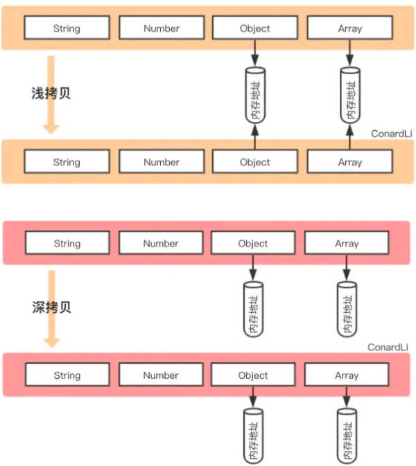

## 数据类型的存储
JavaScript中存在两大数据类型：
1.基本类型：string  number  boolean  null   undefined   symbol(es6新增)     
2.引用类型：Array   object  function   

基本类型数据保存在在栈内存中

引用类型数据保存在堆内存中，引用数据类型的变量是一个指向堆内存中实际对象的引用，存在栈中
## 浅拷贝
1.如果属性是基本类型，拷贝的就是基本类型的值。如果属性是引用类型，拷贝的就是内存地址
2.当原有对象发生变化的时候，拷贝对象也跟着变化
3.拷贝一层，深层次的对象级别的就拷贝引用
（即浅拷贝是拷贝一层，深层次的引用类型则共享内存地址）
### 浅拷贝代码实现
```
    function shallowClone(source) {
        // 先判断一下传进来需要拷贝的是对象还是数组
        let target = source.constructor == Array ? [] : {};
        for (const key in source) {
            // console.log(key); //name age child
            target[key] = source[key];
        }
        return target;
    }
```
实例
```
    let obj1 = {
        name: 'Tom',
        age: 45,
        reg: /\d/,
        data: undefined,
        child: {
            name: 'juery',
            age: 10
        },
        say: function () {
            console.log('saying');
        }
    }

    let obj3 = shallowClone(obj1);
    obj3.child.age = 12; //会导致obj1.child.age也改变 
    console.log(obj1);
    console.log(obj3);
```
### 存在浅拷贝的现象
1.slice()   -->    Array.prototype.slice()   
2.concat()  -->    Array.prototype.concat()    
3.扩展运算符      
4.Object.assign      
``` 
    const fxArr = ["One", "Two", "Three"]
    const fxArrs = fxArr.slice(0)
    fxArrs[1] = "love";
    console.log(fxArr) // ["One", "Two", "Three"]
    console.log(fxArrs) // ["One", "love", "Three"]

    const fxArr1 = ["One", "Two", "Three"]
    const fxArr1s = fxArr.concat()
    fxArr1s[1] = "love";
    console.log(fxArr1) // ["One", "Two", "Three"]
    console.log(fxArr1s) // ["One", "love", "Three"] 

    const fxArr2 = ["One", "Two", "Three"]
    const fxArr2s = [...fxArr]
    fxArr2s[1] = "love";
    console.log(fxArr2) // ["One", "Two", "Three"]
    console.log(fxArr2s) // ["One", "love", "Three"]

    let obj1 = {
        name: 'Tom',
        age: 45,
        reg: /\d/,
        data: undefined,
        child: {
            name: 'juery',
            age: 10
        },
        say: function () {
            console.log('saying');
        }
    }

    let obj2 = {};
    var newObj = Object.assign(obj2, obj1);
    obj2.name = "Alice";
    console.log(obj2);  //Alice
    console.log(obj1);  //Tom
    obj2.child.name = "zhangsan";
    console.log(obj2);   //zhangsan
    console.log(obj1);   //zhangsan
```
 Object.assign({},obj)
优点：   
    1.可以拷贝函数   
    2.可以拷贝正则   
    3.可以拷贝undefined   
缺点：
    1.二级以下无法实现深拷贝   
## 深拷贝
深拷贝开辟一个新的栈，两个对象属性完成相同，但是对应两个不同的地址，修改一个对象的属性，不会改变另一个对象的属性   
    1.另外申请了一块内存   
    2.内容和原来对象一样   
    3.更改原对象，拷贝对象不会发生变化   
    4.拷贝多层，每一级别的数据都会拷贝出来   
### 深拷贝代码实现
```
    function deepCopy(source) {
        let target = source.constructor == Array ? [] : {};
        for (const key in source) {
            if (typeof source[key] === "object") {
                target[key] = copy(source[key]);
            } else {
                target[key] = source[key];
            }
        }
        return target;
    }
```
### 常见的深拷贝方式
1._.cloneDeep()   
2.JSON.parse(JSON.stringify())   
```
    const _ = require('lodash');
    const obj1 = {
        a: 1,
        b: { f: { g: 1 } },
        c: [1, 2, 3]
    };
    const obj2 = _.cloneDeep(obj1);
    console.log(obj1.b.f === obj2.b.f);// false
```
```
let obj1 = {
    name: 'Tom',
    age: 45,
    reg: /\d/,
    data: undefined,
    child: {
        name: 'juery',
        age: 10
    },
    say: function () {
        console.log('saying');
    }
}

let obj5 = JSON.parse(JSON.stringify(obj1));
obj1.age = 88;
obj1.child.age = 99;
console.log(obj1); //88   99
console.log(obj5); //45   10
```
JSON.parse(JSON.stringify())    
问题：  
    1.函数无法拷贝   
    2.正则无法拷贝     
    3.undefined无法拷贝    
    4.symbol会被忽略   
优点：   
    1.二级以下也可以实现深拷贝   
## 区别

从上图发现，浅拷贝和深拷贝都创建出一个新的对象，但在复制对象属性的时候，行为就不一样   

浅拷贝只复制属性指向某个对象的指针，而不复制对象本身，新旧对象还是共享同一块内存，修改对象属性会影响原对象  

但深拷贝会另外创造一个一模一样的对象，新对象跟原对象不共享内存，修改新对象不会改到原对象 
## 小结
前提为拷贝类型为引用类型的情况下：
1.浅拷贝是拷贝一层，属性为对象时，浅拷贝是复制，两个对象指向同一个地址

2.深拷贝是递归拷贝深层次，属性为对象时，深拷贝是新开栈，两个对象指向不同的地址