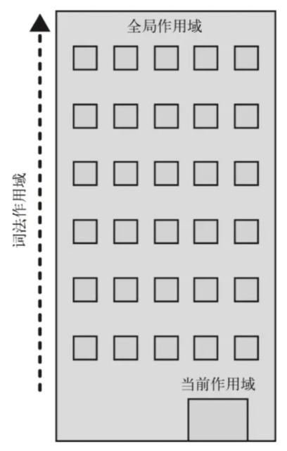

## 一、作用域
作用域，即变量（变量作用域又称上下文）和函数生效（能被访问）的区域或集合    
换句话说，作用域决定了代码区块中变量和其他资源的可见性      
我们一般将作用域分成：    
1.全局作用域   
2.函数作用域   
3.块级作用域   
### 全局作用域
任何不在函数中或是大括号中声明的变量，都是在全局作用域下，全局作用域下声明的变量可以在程序的任意位置访问
```
    // 全局变量
    var greeting = 'Hello World!';
    function greet() {
    console.log(greeting);
    }
    // 打印 'Hello World!'
    greet();
```
### 函数作用域
函数作用域也叫局部作用域，如果一个变量是在函数内部声明的它就在一个函数作用域下面。这些变量只能在函数内部访问，不能在函数以外去访问
```
    function greet() {
    var greeting = 'Hello World!';
    console.log(greeting);
    }
    // 打印 'Hello World!'
    greet();
    // 报错：Uncaught ReferenceError: greeting is not defined
    console.log(greeting);
```
可见上述代码中在函数内部声明的变量或函数，在函数外部是无法访问的，这说明在函数内部定义的变量或者方法只是函数作用域
### 块级作用域
ES6引入了let和const关键字,和var关键字不同，在大括号中使用let和const声明的变量存在于块级作用域中。在大括号之外不能访问这些变量
```
    {
    // 块级作用域中的变量
    let greeting = 'Hello World!';
    var lang = 'English';
    console.log(greeting); // Prints 'Hello World!'
    }
    // 变量 'English'
    console.log(lang); // English
    // 报错：Uncaught ReferenceError: greeting is not defined
    console.log(greeting);
```
## 二、词法作用域
词法作用域，又叫静态作用域，变量被创建时就确定好了，而非执行阶段确定的。也就是说我们写好代码时它的作用域就确定了，JavaScript 遵循的就是词法作用域 
```
    var a = 2;
    function foo(){
        console.log(a)
    }
    function bar(){
        var a = 3;
        foo();
    }
    n()
``` 
上述代码改变成一张图  

由于JavaScript遵循词法作用域，相同层级的 foo 和 bar 就没有办法访问到彼此块作用域中的变量，所以输出2  
## 三、作用域链
当在Javascript中使用一个变量的时候，首先Javascript引擎会尝试在当前作用域下去寻找该变量，如果没找到，再到它的上层作用域寻找，以此类推直到找到该变量或是已经到了全局作用域    

如果在全局作用域里仍然找不到该变量，它就会在全局范围内隐式声明该变量(非严格模式下)或是直接报错    
### 举个例子方便理解
把作用域比喻成一个建筑，这份建筑代表程序中的嵌套作用域链，第一层代表当前的执行作用域，顶层代表全局作用域
  
变量的引用会顺着当前楼层进行查找，如果找不到，则会往上一层找，一旦到达顶层，查找的过程都会停止
### 代码实例
```
    var sex = '男';
    function person() {
        var name = '张三';
        function student() {
            var age = 18;
            console.log(name); // 张三
            console.log(sex); // 男 
        }
        student();
        console.log(age); // Uncaught ReferenceError: age is not defined
    }
    person();
```
上述代码主要主要做了以下工作：
1.student函数内部属于最内层作用域，找不到name，向上一层作用域person函数内部找，找到了输出“张三”    
2.student内部输出sex时找不到，向上一层作用域person函数找，还找不到继续向上一层找，即全局作用域，找到了输出“男”     
3.在person函数内部输出age时找不到，向上一层作用域找，即全局作用域，还是找不到则报错   
 