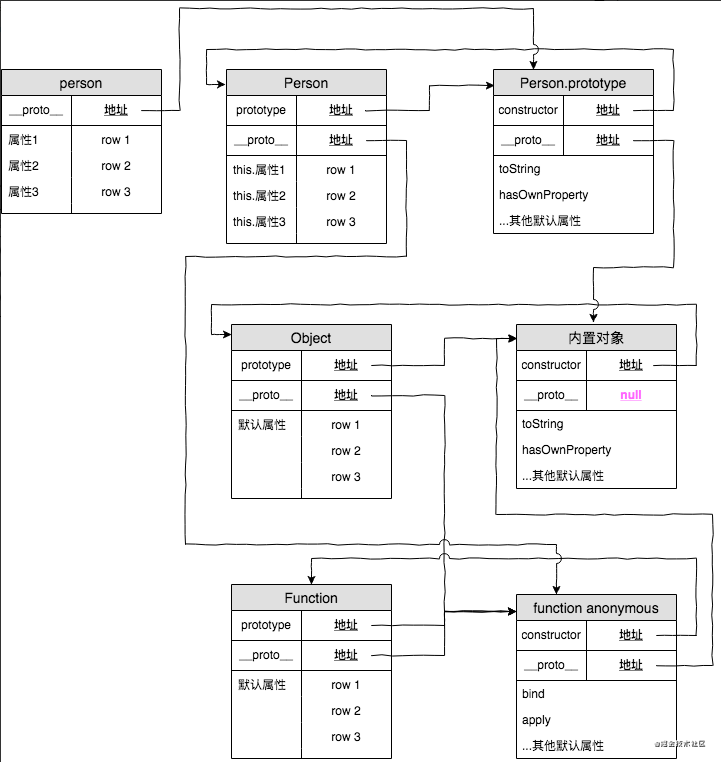

## 一、创建对象的方式
1.new Object()   
2.{} 对象直接量   
3.Object.create()
### new Object()
```
    var o1 = new Object();
    o1.name = 'lisi';
    o1.age = 12;
    o1.sayHello = function () {
        console.log('……');
    }
    console.log(o1);
    console.log(o1.__proto__ == Object.prototype);  //true
```
### {} 对象直接量
```
    var o2 = {
        name: 'lisi',
        age: 12,
        sayHello: function () {
            console.log('...');
        }
    }
```
### Object.create()
该方法创建一个新对象，使用现有的对象来提供新创建对象的__proto__
创建了新对象o3,使用o1来提供o3的__proto__
```
var o3 = Object.create(o1);
console.log(o3.__proto__ == o1);  //true
console.log(o3); //{}
// 修改o1现有属性
o1.name = 'wangwu';
console.log(o3.name);  //wangwu
// 给实例化对象o3添加属性而不是修改现有对象o1的属性
o3.name = 'tianqi';
console.log(o3.name);   //tianqi
console.log(o1.name);   //wangwu
```
可理解为（不太准确）：更改父对象的属性会影响子对象的属性，更改子对象的属性不会影响父对象的属性    
Object.create()方法：
1.用现有的对象创建一个新的对象，现有的对象本身有一个__proto__属性,属性值是一个对象   
2.创建的新对象会把从现有对象的属性继承过来（其实不是继承，但是目前可以这么理解），    
3.放到自身的__proto__属性中，属性值是一个对象   
## 二、原型
所有对象都有一个__proto__（隐式原型）属性，属性值是一个普通对象    
所有函数都有prototype（原型）属性，属性值是一个普通的对象     
所有对象的__proto__属性指向它构造函数的prototype    
### 下面举个例子
函数可以有属性。每个函数都有一个特殊的属性叫作原型prototype
```
    function doSomething(){}
    console.log( doSomething.prototype );
```
控制台输出
```
    {
        constructor: ƒ doSomething(),
        __proto__: {
            constructor: ƒ Object(),
            hasOwnProperty: ƒ hasOwnProperty(),
            isPrototypeOf: ƒ isPrototypeOf(),
            propertyIsEnumerable: ƒ propertyIsEnumerable(),
            toLocaleString: ƒ toLocaleString(),
            toString: ƒ toString(),
            valueOf: ƒ valueOf()
        }
    }
```
上面这个对象，就是大家常说的原型对象      
原型对象有一个自有属性constructor，这个属性指向该函数，如下图关系展示

## 三、原型链
当访问一个对象的某个属性时，会先在这个对象本身属性上查找，如果没有找到   
则会去它的__proto__隐式原型上查找，即它的构造函数的prototype，   
如果还没有找到就会再在构造函数的prototype的__proto__中查找，   
这样一层一层向上查找就会形成一个链式结构，我们成为原型链   
p1.name => p1.__proto__ => p1.__proto__.__proto__...
```
function Person(name){
    this.name = name;
    this.brother = {
        name:'lala'
    }
}
var p1 = new Person("xiaowang");
console.log(p1.__proto__ == Person.prototype);  //true
```
p1.__proto__:是私有的，不会被用户看到，也不会且不允许被其他人更改的属性
为了这解决这一问题，Person.prototype相当于是p1.__proto__，可以使用 Person.prototype.属性 来添加或更改实例化对象的属性

### 分析
1.构造函数Person存在原型对象Person.prototype

2.构造函数生成实例对象person，person的__proto__指向构造函数Person原型对象

3.Person.prototype.__proto__ 指向内置对象，因为 Person.prototype 是个对象，默认是由 Object函数作为类创建的，而 Object.prototype 为内置对象

4.Person.__proto__ 指向内置匿名函数 anonymous，因为 Person 是个函数对象，默认由 Function 作为类创建

5.Function.prototype 和 Function.__proto__同时指向内置匿名函数 anonymous，这样原型链的终点就是 null   
### 总结
下面首先要看几个概念：   
__proto__作为不同对象之间的桥梁，用来指向创建它的构造函数的原型对象的    

每个对象的__proto__都是指向它的构造函数的原型对象prototype的
```
    person1.__proto__ === Person.prototype
```
构造函数是一个函数对象，是通过 Function构造器产生的
```
    Person.__proto__ === Function.prototype
```
原型对象本身是一个普通对象，而普通对象的构造函数都是Object
```
    Person.prototype.__proto__ === Object.prototype
```
所有的构造器都是函数对象，函数对象都是 Function构造产生的
```
    Object.__proto__ === Function.prototype
```
Object的原型对象也有__proto__属性指向null，null是原型链的顶端
```
    Object.prototype.__proto__ === null
```
下面作出总结：
一切对象都是继承自Object对象，Object 对象直接继承根源对象null

一切的函数对象（包括 Object 对象），都是继承自 Function 对象

Object 对象直接继承自 Function 对象

Function对象的__proto__会指向自己的原型对象，最终还是继承自Object对象